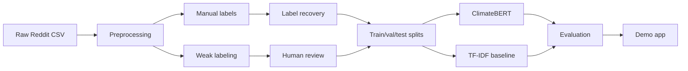

# Project Overview — Climate Nihilism Detection

## Motivation

Climate **nihilism** (doomism, futility, “nothing we do matters”) is increasingly visible in online discourse but is easily confused with **climate anxiety** (worry without giving up) and **Climate nihilism critique** (pushback against doomism). Automated detection helps researchers and moderators study how fatalistic climate narratives spread on social media.

## Why climate nihilism matters

Nihilistic framing can discourage collective action, distort policy debate, and overlap with denial or apathy in subtle ways. A classifier that separates nihilism from nearby opinions supports targeted analysis and healthier public conversation.

## Why Reddit

Reddit hosts large, text-rich discussions across political and science communities. Comments are relatively self-contained, publicly available in research settings, and reflect informal language (sarcasm, memes, pushback) that mirrors real-world opinion expression.

## Why ClimateBERT

General-purpose embeddings under-represent climate-specific vocabulary and framing. **[ClimateBERT](https://huggingface.co/climatebert)** (`climatebert/distilroberta-base-climate-f`) is a domain-adapted language model trained on climate corpora, making it a strong choice for embedding-based classifiers and optional fine-tuning on our 14-label taxonomy.

## Workflow overview

| Stage | Owner | Location |
|-------|--------|----------|
| Preprocessing & taxonomy | Madeleine | `src/preprocessing/`, `src/labeling/` |
| Gold labels & splits | Madeleine / team | `data/labeled/` |
| ClimateBERT | Jinxi | `src/climatebert/` |
| TF-IDF baselines | Liu | `src/tfidf/` |
| Demo | Josh | `app/` |

See [team_responsibilities.md](team_responsibilities.md) for file-level ownership.
